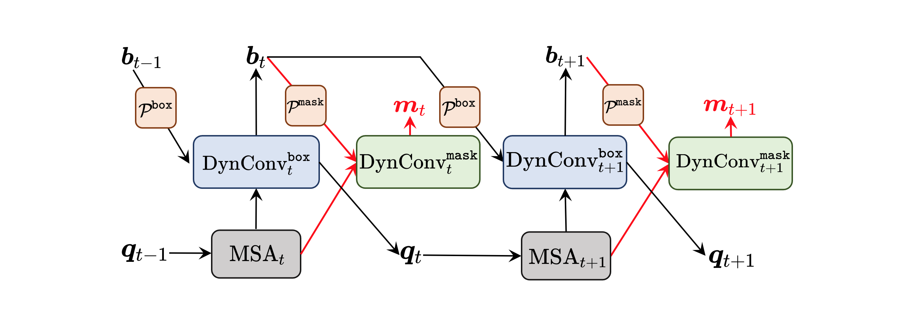

<div align="center">   

## QueryInst: Parallelly Supervised Mask Query for Instance Segmentation
</div>

[](https://paperswithcode.com/sota/instance-segmentation-on-coco-minival?p=queryinst-parallelly-supervised-mask-query)
[](https://paperswithcode.com/sota/instance-segmentation-on-coco?p=queryinst-parallelly-supervised-mask-query)
[](https://paperswithcode.com/sota/object-detection-on-coco-minival?p=queryinst-parallelly-supervised-mask-query)
[](https://paperswithcode.com/sota/object-detection-on-coco?p=queryinst-parallelly-supervised-mask-query)

* **TL;DR:** QueryInst is a simple and effective query based instance segmentation method driven by parallel supervision on dynamic mask heads, which outperforms previous arts in terms of both accuracy and speed.
* Our QueryVIS based on QueryInst won [**the 2nd place** `(AP = 52.3 @ test set, AP = 54.3 @ val set)`](https://competitions.codalab.org/competitions/28988#results) in video instance segmentation (VIS) track with **single model, single scale testing & without using extra video training data** in the [3rd Large-scale Video Object Segmentation Challenge, CVPR 2021](https://youtube-vos.org/challenge/2021/). 
* For the first time, we demonstrate that an end-to-end query based framework driven by parallel supervision is competitive with well-established and highly-optimized methods in a wide range of instance-level recognition tasks ([object detection](https://paperswithcode.com/sota/object-detection-on-coco), [instance segmentation](https://paperswithcode.com/sota/instance-segmentation-on-coco) and video instance segmentation).

> [**QueryInst: Parallelly Supervised Mask Query for Instance Segmentation**](http://arxiv.org/abs/2105.01928),
>
> by [Yuxin Fang\*](https://scholar.google.com/citations?user=_Lk0-fQAAAAJ&hl=en), Shusheng Yang\*, [Xinggang Wang†](https://xinggangw.info/), [Yu Li](http://yu-li.github.io), [Chen Fang](https://scholar.google.com/citations?hl=en&user=Vu1OqIsAAAAJ&view_op=list_works&citft=1&email_for_op=2yuxinfang%40gmail.com&gmla=AJsN-F5phq2a5UjdoNudoavuaCbem43ptau5cM8rWScWoxkUm0xFgCl6q49r-6MAWh-X9FVZCv9GuLk8D4u-ka0hVjKEWibox_kN9B346lA80Mrl4bUyDHBjwmbvsAfEBZ56neZ0D9p5neQBX8dBp8dD1I3248R0n0vVvzlfILA9oVpcn7xy6P0MQHUY-g0VT2g7sV6LJSPB7ZGyJFGqUk2SJ4MHRxG8U7Hz28WGuobOz-lrTnehfz5wsbwAaLETSZbP3vEMQ3Hc), [Ying Shan](https://scholar.google.com/citations?user=4oXBp9UAAAAJ&hl=en), Bin Feng, [Wenyu Liu](http://eic.hust.edu.cn/professor/liuwenyu/).
>
> (\*) equal contribution, (†) corresponding author.
> 
> *arXiv technical report ([arXiv 2105.01928](http://arxiv.org/abs/2105.01928))*



* This repo serves as the official implementation for [QueryInst](http://arxiv.org/abs/2105.01928), based on [mmdetection](https://github.com/open-mmlab/mmdetection) and built upon [Sparse R-CNN](https://github.com/PeizeSun/SparseR-CNN) & [DETR](https://github.com/facebookresearch/detr). Implantations based on [Detectron2 ](https://github.com/facebookresearch/detectron2) will be released in the near future.

* This project is under active development, we will extend [QueryInst](http://arxiv.org/abs/2105.01928) to a wide range of instance-level recognition tasks.


### Main Results on COCO test-dev

|                            Configs                            |        Aug.         | Weights | Box AP | Mask AP |
| :----------------------------------------------------------: | :----------------: | :-----: | :----: | :-----: |
|              QueryInst_Swin_L_300_queries (single scale testing)               | 400 ~ 1200, w/ Crop |    -    |  [56.1](https://gist.github.com/Yuxin-CV/f477cb2a310e2db2b26112ae0f167baf)  |  [49.1](https://gist.github.com/Yuxin-CV/0e93ec9ab4c2d05be2d8a6cc61cd2f6b)   |


### Main Results on COCO val

|                            Configs                            |        Aug.         | Weights | Box AP | Mask AP |
| :----------------------------------------------------------: | :----------------: | :-----: | :----: | :-----: |
| [QueryInst\_R50\_3x\_300_queries](configs/queryinst/queryinst_r50_fpn_300_proposals_crop_mstrain_480-800_3x_coco.py) | 480 ~ 800, w/ Crop |    -    |  46.9  |  41.4   |
| [QueryInst\_R101\_3x\_300_queries](configs/queryinst/queryinst_r101_fpn_300_proposals_crop_mstrain_480-800_3x_coco.py) | 480 ~ 800, w/ Crop |    -    |  48.0  |  42.4   |
|              QueryInst_X101-DCN_3x_300_queries               | 480 ~ 800, w/ Crop |    -    |  50.3  |  44.2   |
|              QueryInst_Swin_L_300_queries (single scale testing)          | 400 ~ 1200, w/ Crop |    -    |  56.1  |  48.9   |


### Getting Started

* Our project is mainly developed on [mmdetection toolbox `(931d96)`](https://github.com/open-mmlab/mmdetection), please refer to the [mmdetection official installation](https://github.com/open-mmlab/mmdetection/blob/master/docs/get_started.md).
* Install `QueryInst` by:

```bash
python setup.py develop
```

* Prepare datasets:

```bash
mkdir data && cd data
ln -s /path/to/coco coco
```

* Training QueryInst with single GPU:

```bash
python tools/train.py configs/queryinst/queryinst_r50_fpn_1x_coco.py
```

* Training QueryInst with multi GPUs:

```bash
./tools/dist_train.sh configs/queryinst/queryinst_r50_fpn_1x_coco.py 8
```

* Test QueryInst on COCO val set with single GPU:

```bash
python tools/test.py configs/queryinst/queryinst_r50_fpn_1x_coco.py PATH/TO/CKPT.pth --eval bbox segm
```

* Test QueryInst on COCO val set with multi GPUs:

```bash
./tools/dist_test.sh configs/queryinst/queryinst_r50_fpn_1x_coco.py PATH/TO/CKPT.pth 8 --eval bbox segm
```

### Citation

If you find our paper and code useful in your research, please consider giving a star :star: and citation :pencil: :

```BibTeX
@article{QueryInst,
  title={QueryInst: Parallelly Supervised Mask Query for Instance Segmentation},
  author={Fang, Yuxin and Yang, Shusheng and Wang, Xinggang and Li, Yu and Fang, Chen and Shan, Ying and Feng, Bin and Liu, Wenyu},
  journal={arXiv preprint arXiv:2105.01928},
  year={2021}
}
```

### TODO

- [x] QueryInst training and inference code.
- [ ] QueryInst based on [Detectron2 toolbox](https://github.com/facebookresearch/detectron2) will be released in the near future.
- [ ] QueryInst configurations for Cityscapes and YouTube-VIS.
- [ ] QueryInst pretrain weights.
